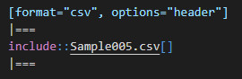

//==========
// Attribute
//==========

// 文書の情報
// * :version-label: を値無しにすることで好みの記述にできます。
:lang: ja
:doctype: book
:author: WAKU-TAKE-A
:revdate: 2019年10月13日
:revnumber: 1.1版
:version-label:
:pdf-style: my-theme.yml
:source-highlighter: rouge
:rouge-style: pastie

//===========
// Body
//===========

= CSVから表を作成する

== 概要

AsciiDocで表（テーブル）を作成する方法は、 https://takumon.github.io/asciidoc-syntax-quick-reference-japanese-translation/#_%E3%83%86%E3%83%BC%E3%83%96%E3%83%AB[こちら] にある説明の通りです。

いろいろな方法があって悩みます。私はCSVデータから作成する方法が好きです。

== 標準的な書き方の例

記述方法：

....
[cols="1,1,2", options="header"]
|===
|アーティスト
|トラック
|ジャンル

|Baauer
|Harlem Shake
|Hip Hop

|The Lumineers
|Ho Hey
|Folk Rock
|===
....

結果の表示:

[cols="1,1,2", options="header"]
|===
|アーティスト
|トラック
|ジャンル

|Baauer
|Harlem Shake
|Hip Hop

|The Lumineers
|Ho Hey
|Folk Rock
|===

CSVデータやファイルから作成するより、複雑な表を作成することが可能です。

== CSVデータから

記述方法：

....
[format="csv", options="header"]
|===
アーティスト,トラック,ジャンル
Baauer,Harlem Shake,Hip Hop
The Lumineers,Ho Hey,Folk Rock
|===
....

結果の表示：

[format="csv", options="header"]
|===
アーティスト,トラック,ジャンル
Baauer,Harlem Shake,Hip Hop
The Lumineers,Ho Hey,Folk Rock
|===

== CSVファイルから

記述方法：

結果の表示：

[format="csv", options="header"]
|===
include::Sample005.csv[]
|===

ちなみに、CSVデータ・ファイルから作成する場合も、`cols="1,1,2"` は利用することが可能です。

== メモ

本サンプルでは、スタイルファイルにおいて以下のように設定し、偶数と奇数の行の色が同じになるように設定しています。

[source, yaml, indent=4]
----
table_body:
  background_color: [255,255,255]
  stripe_background_color: [255,255,255]
----